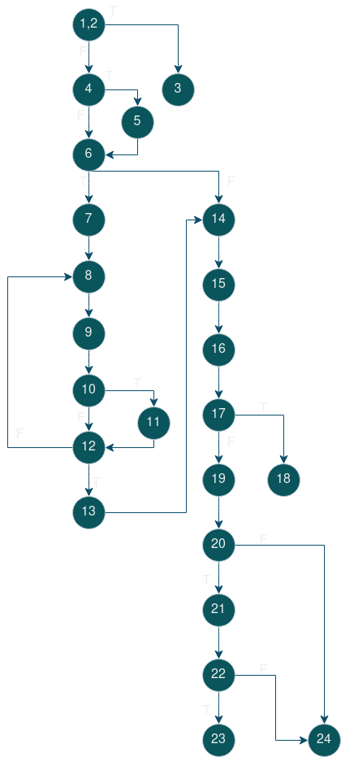

Viktor Korunoski 216120

2. 
3. Ciklicna kompeksnost e 9 i e presmetav prema toa kolku predikatni jazni ima. P+1=8+1=9
note: Ne mozev da uspeam gradle da go inicializiram na sistemot i ne uspeav da gi izvedam 
testotovite. 
